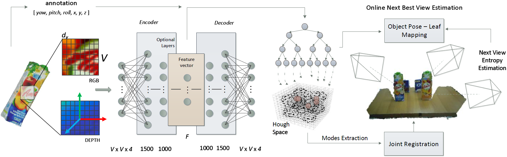
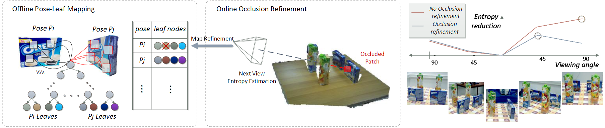

# Recovering 6D Object Pose and Predicting Next-Best-View in the Crowd - CVPR 2016


## Abstract
6D object detection and pose estimation in the crowd (scenes with multiple object instances, severe foreground occlusions and background distractors), has become an important problem in many rapidly evolving technological areas such as robotics and augmented reality. Single shot-based 6D pose estimators with manually designed features are still unable to tackle the above challenges, motivating the research towards unsupervised feature learning and next-best-view estimation. In this work, we present a complete framework for both single shot-based 6D object pose estimation and next-best-view prediction based on Hough Forests, the state of the art object pose estimator that performs classification and regression jointly. Rather than using manually designed features we a) propose an unsupervised feature learnt from depth-invariant patches using a Sparse Autoencoder and b) offer an extensive evaluation of various state of the art features. Furthermore, taking advantage of the clustering performed in the leaf nodes of Hough Forests, we learn to estimate the reduction of uncertainty in other views, formulating the problem of selecting the next-best-view. To further improve 6D object pose estimation, we propose an improved joint registration and hypotheses verification module as a final refinement step to reject false detections. We provide two additional challenging datasets inspired from realistic scenarios to extensively evaluate the state of the art and our framework. One is related to domestic environments and the other depicts a bin-picking scenario mostly found in industrial settings. We show that our framework significantly outperforms state of the art both on public and on our datasets.



## Contributions
- A complete framework for 6 DoF object detection that comprises of a) an architecture based on Sparse Autoencoders for unsupervised feature learning, b) a 6D Hough voting scheme for pose estimation and c) a novel active vision technique based on Hough Forests for estimating the next-best-view.
- Extensive evaluation of features and detection methods on several public datasets.
- A new dataset of RGB-D images reflecting two usage scenarios, one representing domestic environments and the other a bin-picking scenario found in industrial settings. We provide 3D models of the objects and, to the best of our knowledge, the first fully annotated bin-picking dataset.

## Video
[Video](https://www.youtube.com/watch?v=AZpoB673M8w)

## Downloads
[Paper](./docs/6D_NBV_CVPR_2016.pdf)

## Dataset
[Scenario 1 257MB](https://drive.google.com/open?id=164fQd40LP152LIuVPgQ3CJ7tIlc9v971) - [Scenario 2 108MB](https://drive.google.com/open?id=1YrtYNK-bxBQeX0Gh-OwAyVmNcj4nOA0k)


If you make use of the dataset please cite:
```
@inproceedings{doumanoglou2016recovering,
  title={Recovering 6D object pose and predicting next-best-view in the crowd},
  author={Doumanoglou, Andreas and Kouskouridas, Rigas and Malassiotis, Sotiris and Kim, Tae-Kyun},
  booktitle={Proceedings of the IEEE Conference on Computer Vision and Pattern Recognition},
  pages={3583--3592},
  year={2016}
}
```